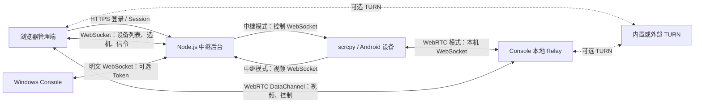

# scrcpy-web 多客户端与管理后台通信审计报告

审计日期：2026-09-15  
代码基线：`705b164`（审计开始时工作区无未提交修改）  
审计方式：源码审查、隔离服务集成复现、真实依赖的离线鉴权验证  
审计范围：浏览器管理端、Node.js 中继后台、Windows Console、scrcpy 视频/控制连接、WebRTC 信令及内置 TURN

## 1. 结论与适用范围

**当前系统的多客户端通信隔离、设备连接鉴权和连接生命周期管理仍不完整。特别是开启控制台 Token 后，视频与控制通道仍存在独立的未认证入口，不能据此认定整个系统已完成鉴权。**

本次列出 **16 项主要发现：10 项 P1、6 项 P2**，另列接口暴露、访问权限等补充观察。P1 表示应优先修复的安全问题或核心通信功能缺陷，P2 表示随后处理的可靠性、协议或一致性问题；优先级不等同于 CVSS 分数。

已经在本地隔离环境确认：

- 两个控制台上报相同序列号时，A 预注册的视频流会发送给 B 的观看者。
- 未认证连接可以占用已注册设备的控制下行通道，接收本应交给 scrcpy 的触控消息。
- 未认证控制连接发送一个非法 WebSocket 帧，会使整个 Node.js 中继进程退出。
- HTTP 退出登录成功、会话查询返回 401 后，原有 WebSocket 仍可下发设备操作。
- INFO 日志写入完整的登录 Session Cookie。
- WebRTC 信令只向一个匹配观看者发送 Offer，并接受非参与者提交的 Answer/ICE。
- 内置 TURN 的实际依赖没有使用传入的 `authFunc`，最终采用 `authMech=none`。
- 设备信息更新和旧连接关闭，会使当前连接引用、设备状态出现错误。

同时确认两项已有修复有效：配置 `CONSOLE_TOKEN` 后会拒绝无 Token 的控制台；同设备一个观看者主动退出时，不再无条件停止其他人的推流。

**本报告针对本地当前源码与已安装依赖，不是线上主机渗透测试报告。** 未连接生产服务器、未读取生产凭据、未操作真实手机；未在 Windows/Android 上编译运行客户端，也未实测公网 NAT/TURN 穿透。涉及生产端口暴露、线上环境变量和已发布二进制版本的情况，需要部署核验后才能确定实际暴露程度。

## 2. 实际通信拓扑



| 链路 | 现有身份或路由依据 | 主要缺口 |
| --- | --- | --- |
| 浏览器 → REST API | `scrcpy.sid` 会话 | 退出按钮未调用退出 API；部分接口暴露内部对象 |
| 浏览器 → 管理 WebSocket | 建连时 Session + Origin 校验 | 无持续会话撤销；无统一错误处理；RTC 消息缺少参与者校验 |
| Console → 后台 | 可选全局 `CONSOLE_TOKEN` | 默认兼容放行；原生连接不使用 TLS；没有稳定 Console 身份 |
| scrcpy 视频 → 后台 | 全局 serial 预注册，或 Session | 无设备专属票据；预注册归属没有用于绑定；无有效期 |
| 后台 → scrcpy 控制 | serial 对应设备存在即放行连接 | 连接者未认证；任何人可抢占接收端 |
| 浏览器 ↔ Console P2P | `deviceId` 索引的单个 Peer | 多观看者不成立；会话撤销未传递到 P2P |
| scrcpy ↔ 本地 Relay | 127.0.0.1 TCP + 自写 WebSocket 解析 | 短读处理不完整；帧长度边界不足 |
| TURN | 自定义 `authFunc` 配置 | 与 `node-turn@0.0.6` 的实际接口不匹配 |

## 3. 风险清单

| 编号 | 优先级 | 发现 | 证据类型 |
| --- | --- | --- | --- |
| F01 | P1 | 设备视频与控制连接未绑定可验证身份 | 隔离集成复现 |
| F02 | P1 | 同序列号设备跨控制台错配，失联后还会自动跨控制台选机 | 集成复现 + 源码 |
| F03 | P1 | 非法 WebSocket 帧触发未处理错误，退出整个后台进程 | 隔离集成复现 |
| F04 | P1 | 内置 TURN 实际使用无认证模式 | 实际初始化逻辑 + 真实依赖离线验证 |
| F05 | P1 | 退出按钮不销毁会话；服务端退出也不撤销已连接客户端 | 集成复现 + 源码 |
| F06 | P1 | 日志包含可重放的完整 Session Cookie | 隔离集成复现 |
| F07 | P1 | Console 和中继 scrcpy 链路不使用 TLS | 源码确认 |
| F08 | P1 | WebRTC 信令未绑定会话参与者与设备归属 | 模块复现 |
| F09 | P1 | WebRTC 每设备只有一个观看者槽位 | 模块复现 + 原生端源码 |
| F10 | P1 | WebSocket 回退无法完成控制，P2P 失败也未切换视频来源 | 源码确认 |
| F11 | P2 | 设备快照替换和旧连接关闭破坏运行态 | 隔离集成复现 |
| F12 | P2 | Ping 没有失活判定；无人观看的空闲回收计时错误 | 源码确认 |
| F13 | P2 | 原生 WebSocket 握手、帧解析和部分 JSON 字段存在边界问题 | 源码确认，未做原生运行验证 |
| F14 | P2 | 重连改变设备身份，却没有完整的清理与重新订阅流程 | 源码确认 |
| F15 | P2 | WebSocket 中继新观看者缺少解码启动数据 | 源码确认 |
| F16 | P2 | 别名与分组仍通过 serial 跨控制台传播 | 源码确认 |

## 4. 详细发现

### F01 — 设备通道未认证，控制台 Token 没有覆盖完整链路

**位置：** `relay-server/server.js:790–834、1024–1035、1243–1257、550–587`。

`type=control` 仅要求 serial 存在于某个控制台，没有校验 Token、Session、连接来源或设备票据。随后直接设置 `device.controlWs = ws`。任何能访问此端点且知道一个在线 serial 的连接者，都能替换正常控制连接。

`type=scrcpy` 只要发现 `pendingDeviceStreams.has(serial)` 就放行并消费记录。预注册不生成随机票据、不绑定使用者、不设置超时；Console 断开也没有清理该表。攻击者可以抢先消费预注册记录，导致合法推流失败，或发送伪造的视频内容。

隔离测试在已强制配置 Console Token 的情况下，未认证控制连接成功收到浏览器的 `touch` 消息；无凭据视频连接也成功消费另一控制台的预注册。

**影响边界：** 该控制连接本身是服务端向 scrcpy 发送消息的下行接收端。已证实的是接收端抢占、指令截获和控制中断，不能把它直接描述为“向此 socket 发消息即可任意操控手机”。视频入口已证实可注入模拟二进制帧，未测试浏览器解码器漏洞。

**建议：** Console 完成认证后，由服务端签发短期、单次、绑定稳定 Console ID、serial、streamSessionId 和通道角色的票据；视频和控制分别验证并原子消费。删除基于 serial 的免密放行。HTTP 预注册接口也应使用明确的 Console 凭据，而非 IP 一致性作为身份认证。

### F02 — 列表隔离已修复，实际视频和控制路由仍会串台

**位置：** `relay-server/server.js:612–669、819–823、894–901、1018–1025、1366–1375`；`app/src/websocket_sink.c:462–481`。

设备列表已经使用 `consoleId:serial`，但 scrcpy 两条连接仍只携带 serial。视频认证分支取得预注册记录中的 consoleId 后没有把它传入后续绑定；后续重新调用全局 `findDeviceBySerial(serial)`，优先选择更新连接的控制台。

**复现：** A、B 都上报 `emulator-5554`；两个浏览器分别选择 A、B；由 A 预注册，然后发送一个模拟视频帧。结果 A 的观看者收到 0 帧，B 的观看者收到该帧。

另外，用户指定的 Console 失联时，`selectDevice` 会自动寻找其他 Console 的同 serial 设备。对不同地点的模拟器或相同内网 ADB 地址，这可能代表完全不同的手机。此时前端也没有收到明确的目标变更确认。

**建议：** 全链路使用稳定 Console 身份、serial 和流会话 ID。显式选择的设备不可达时应返回错误；只允许经过身份验证、确认属于同一设备的重连恢复，不能通过 serial 猜测替代设备。

### F03 — 单个未认证连接可导致后台进程退出

**位置：** `relay-server/server.js:752–841、1006–1038、1090–1135`。

目前仅视频连接注册了 `error` 事件监听。Console、Web 和 control 连接都没有完整的错误监听和统一清理。消息回调里的 `try/catch` 捕获不到 WebSocket 解析层异步发出的 `error` 事件。

**复现：** 在隔离服务上建立 F01 所述的未认证控制连接，发送一个缺少客户端掩码的帧。`ws` 抛出未处理的 `MASK` 协议错误，Node.js 子进程非零退出，全部连接一起断开。

**建议：** 每个连接在任何鉴权分支之前安装 `error` 和清理处理；把协议错误限定在该连接内。按照控制、设备列表、视频分别限制消息大小和速率。验收应覆盖非法掩码、超长消息、截断帧和异常断连。

### F04 — 内置 TURN 的鉴权配置未生效

**位置：** `relay-server/turn-server.js:46–64`；已安装依赖 `relay-server/node_modules/node-turn/lib/server.js:48–50`、`lib/authentification.js:19–22`。

应用向 `node-turn` 传递 `authFunc`，但当前安装且锁定的 `node-turn@0.0.6` 读取的是 `authMech` 和 `credentials`。未设置 `authMech` 时，依赖默认采用 `none`；认证函数直接返回成功。

**验证：** 执行应用真实初始化逻辑，使用真实依赖构造函数，仅替换 `start/stop` 防止开启网络监听。观察到 `authMech === 'none'`，不带用户名和密码的认证调用返回成功。

**影响前提：** 只有启用内置 `TURN_ENABLED=true` 时才触发此问题；未对外部独立 TURN 服务下结论。若该服务对公网开放，存在匿名使用中继资源的风险。本次验证止于认证路径，没有执行实际公网 UDP 分配和流量转发。

**建议：** 使用该实现真实支持的认证接口，或改用明确支持临时凭据的 TURN 服务。必须测试缺失凭据、错误凭据、过期凭据均被拒绝；仅能生成 HMAC 不代表服务端实际完成认证。

### F05 — 退出与会话撤销没有作用于全部连接

**位置：** `relay-server/public/app.js:1572–1576`；`relay-server/server.js:362–371、778–784、1092–1097、1329–1333`。

前端退出按钮只清理 localStorage 并跳转登录页，实际身份存放在 HttpOnly Session Cookie 中；按钮没有调用 `/api/logout`。

即使显式调用服务端退出接口，现有 WebSocket 仍保留建连时复制的 user，消息处理不再检查会话是否存在或过期。

**复现：** 登录、建立 WebSocket、选择设备，调用 `/api/logout`；同 Cookie 访问 `/api/user` 得到 401，但原 socket 的触控指令仍被转发。

WebRTC 控制直接经过 DataChannel，后台也没有在退出或会话撤销时通知 Console 关闭对应 Peer 的机制。这部分撤销缺口由源码确认，没有在真实 P2P 连接上演示。

**建议：** 退出按钮调用退出 API并清理当前 WS/Peer；后台维护 Session → WebSocket → Peer 的关联，在退出、过期、权限撤销时关闭对应连接并撤销控制权。必要时给 P2P 控制授权增加短期租约。

### F06 — 日志暴露完整登录凭据

**位置：** `relay-server/server.js:779–781、345–346`；`relay-server/ecosystem.config.js` 默认 `LOG_LEVEL=INFO` 并持久化日志。

WebSocket 升级时把完整 `req.headers.cookie` 输出到 INFO 日志，其中包含可直接重放的已签名 `scrcpy.sid`。同时记录 Session ID。

**验证：** 在隔离服务日志中匹配到测试账户的完整 Cookie；复现脚本仅输出布尔结论，不输出 Cookie 内容。

**建议：** 删除原始 Cookie、Session ID 日志，保留独立关联 ID 和认证结果。部署修复时检查历史日志读取范围并按实际暴露情况撤销相关会话。

### F07 — 原生客户端到后台仍为明文通信

**位置：** `scrcpy-console/scrcpy_console.c:432–504`；`app/src/websocket_sink.c:360–431`；`relay-server/server.js:127–152`。

Console 使用普通 TCP socket 发送 HTTP Upgrade，Token 放在查询参数内；没有 TLS 握手、证书验证或服务端身份校验。scrcpy 中继路径同样使用普通 TCP。开启管理页面 HTTPS 时，后台仍保留 HTTP WebSocket 入口，不会自动加密这些原生连接。

**影响前提：** 在不可信网络传输时，Console Token、设备信息、缩略图、中继视频和控制消息可被链路观察者获取或篡改。WebRTC DataChannel 使用独立传输，但信令仍经过该明文 Console 链路。

**建议：** 原生端使用支持 WSS 和证书校验的实现，或通过受保护隧道接入。将控制台凭据从查询参数移至专用认证字段，并使用每控制台凭据。仅把服务器启用 HTTPS，无法修复原生端代码仍然明文的问题。

### F08 — WebRTC 信令不校验会话参与者

**位置：** `relay-server/webrtc-signaling.js:44–93、116–163、172–211`。

`handleOffer` 接受 Console 提交的任意 deviceId；`handleAnswer` 没有核对发送 Web 是否就是收到 Offer 的参与者；`handleIceCandidate` 的 fromId 没有用于验证归属，转发目的地直接由客户端提供的 deviceId 决定。

**复现：** 实际模块接受未选择设备的 Web 提交的 Answer，并转发给设备 Console；来自 Console B 的 ICE 也被送给 Console A 设备的观看者。

**影响：** 已登录用户或已连接 Console 可以干扰其他设备的协商流程；未配置 Console Token 时入口进一步扩大。未演示完整媒体劫持，不将“信令注入已确认”写成“任意手机媒体窃取已确认”。

**建议：** 每次协商生成 sessionId，记录 Console、Web、设备和协商代次；Offer、Answer、ICE、断开均检查参与者和状态。Candidate 队列还应按发送方向区分，避免把 Console 自己的候选项回发给 Console。

### F09 — WebRTC 多观看者场景并未实现

**位置：** `relay-server/webrtc-signaling.js:62–93、223–242`；`scrcpy-console/webrtc_support.c:55–75、337–350`；`scrcpy-console/scrcpy_console.c:1537–1553`。

后台每个 deviceId 只有一个 `webWs`；遍历观看者时只保留最后一位。原生端同样按 deviceId 存一个连接，没有观看者标识。

**复现：** 两个 Web 同时观看同一个 deviceId，一个 Offer 只发送给最后一个 Web。

后加入的观看者还可能始终等不到 Offer：Console 发现 scrcpy 已在运行就只回复 `startStreaming`，不会建立新 Peer；服务端定义的 `handleWebSelectDevice` 也没有在选机路径调用。即使简单调用它重发旧 Offer，也不能把同一个 Peer 当成多个独立连接使用。

**建议：** 若产品需要同时观看，以 `(deviceId, viewerSessionId)` 建立独立 Peer，视频向每个 Peer 扇出；控制权另行管理。如果只允许一位使用者，应明确返回占用状态并实现授权移交，不能让第二位一直加载。

### F10 — WebSocket 回退只有部分接收代码，没有完整功能链路

**位置：** `relay-server/public/app.js:342–357、1487–1501、1666–1693、693–715`；`scrcpy-console/scrcpy_console.c:1577–1596`；`scrcpy-console/local_video_relay.c:655–704`。

前端按键、触摸、关键帧请求都只向已打开的 DataChannel 发送；P2P 未建立时直接丢弃，没有使用后台现存的 WebSocket `touch/control` 处理分支。

因此使用非 WebRTC 构建的 Console、配置 `WEBRTC_ENABLED=false` 或进入中继回退时，即使有画面也不能通过正常 UI 操作手机。

WebRTC `failed` 分支只输出“回退到 WebSocket”日志。若 scrcpy 正连接本地 Relay，该 Relay 没有把同一视频自动转发到远程后台，也没有控制消息重新启动远程推流；切换浏览器布尔变量不能产生新的中继流。

**建议：** 定义明确的传输状态机，由后台与 Console 确认回退完成；控制、视频、关键帧请求一并切换。验收必须包括禁止 UDP、关闭 WebRTC、连接中途失效、恢复网络后重新连接。

### F11 — 设备运行态引用被快照替换和旧连接回调破坏

**位置：** `relay-server/server.js:895–908、997–1002、1024–1035、1149–1171、1181–1202`。

存在两个独立但相关的生命周期问题：

1. `deviceList/deviceUpdate` 通过新对象替换 Map 中的设备，而视频回调持续引用建连时的旧 `foundDevice`。后续帧、关闭事件更新的是旧对象。
2. 新连接直接覆盖 `videoWs/controlWs`，旧连接关闭时无条件把字段清空，没有检查该字段是否仍指向自己。

**复现：** 推流后发 `deviceUpdate`，再关闭视频，新的设备列表仍显示 `streaming`；替换控制连接后关闭旧连接，指令绕过仍存活的新控制连接回退到 Console；替换视频连接后关闭旧连接，新观看者触发重复启动。

**建议：** 把设备描述与运行态分开，运行态保持稳定对象；关闭回调检查 `currentSocket === closingSocket` 和会话代次。明确替换旧连接的清理顺序。

### F12 — 心跳不判断失活，空闲回收使用了错误的活动时间

**位置：** `relay-server/server.js:925–928、990、1334–1338、1113–1135、1795–1848`。

心跳只是每 30 秒调用 `ping()`，没有 `pong` 时间、失活标记或超时终止，无法在应用层及时清除半开连接。

无人观看时，每个视频帧仍刷新 `lastActivityTime`，空闲检测却依赖该值判断“无人观看时长”。正常持续推流可以一直不能达到空闲阈值。切换设备和浏览器关闭又没有立即停止旧流，进一步留下孤立流。

此外 `viewerCount` 被写成“本帧实际收到数据的连接数”，与订阅者数不同；慢观看者丢帧时计数可能暂时为零。结合 F11 的快照引用问题，还可能出现计数、活动时间停留在旧值的相反故障。

**建议：** 用订阅集合计算观看者数；最后一位离开时设置 `zeroViewersSince`。心跳采用明确的 ping/pong 超时，并为视频、控制和 Peer 执行一致清理。

### F13 — 原生握手、帧解析和部分消息字段边界不完整

**位置：** `scrcpy-console/scrcpy_console.c:498–505、1823–1830、1863–1880、2121–2179`；`scrcpy-console/local_video_relay.c:438–477`；`app/src/websocket_sink.c:415–431`。

- Console 对握手响应仅调用一次 `recv`，未检查实际长度、未补字符串终止符就调用 `strstr`，存在越界读取条件。
- 没有持续读取到 HTTP 头结束；HTTP 101 响应与首个 `welcome` 帧合并到一次 TCP 读取时，多出的 WebSocket 数据会被丢弃。`welcome` 是 Console 获取 clientId 的入口，丢失会影响后续 RTC deviceId。
- 本地 Relay 读取 2 字节头、扩展长度和掩码时，只判断返回值是否大于零，没有保证读满。合法的 TCP 分段即可造成帧解析错位。
- 扩展帧长度使用有符号 int 累积或只取低 32 位，缺少统一的溢出和负值拒绝。
- 部分 `stopDevice/requestKeyFrame/updateDeviceName` 字段仍直接把输入长度用于 256 字节数组，缺少截断或拒绝。`startDevice` 分支已加长度保护，不能据此推断所有分支都已安全。

**证据边界：** 这些问题由源码确认，未进行 Windows ASan 或真实客户端畸形报文测试；字段越界的远程触发需要后台发送相应内容或链路被篡改，不应声称普通浏览器用户已经可以稳定远程执行代码。

**建议：** 优先使用成熟的 WebSocket/JSON 解析实现。保留现有实现时，使用读满函数、保存握手后的剩余字节、无符号宽类型长度和统一硬上限，并为每个字段执行类型、长度校验。

### F14 — 重连缺少稳定身份、级联清理和重新订阅

**位置：** `relay-server/server.js:850–857、876–880`；`relay-server/public/app.js:909–963、1418–1457`；`scrcpy-console/scrcpy_console.c:635–652、1537–1553`。

Console 每次重连都会得到新的随机 ID。旧连接关闭仅从 consoleClients 删除记录，没有集中清理旧设备的视频/控制连接、预注册、viewer 索引和 RTC 协商记录。

浏览器 WebSocket 重连后只等待设备列表，没有自动重新提交当前观看目标；后台新 Web 会话的 `currentDevice` 是 null。旧 Peer 和 Console 进程又可能仍按旧 deviceId 工作，重新选机时原生端“进程已运行”分支不会重建正确的协商。

**建议：** 区分持久 Console ID 与本次 connectionId，增加连接代次。断开集中清理会话资源；重连完成重新认证、设备快照同步和明确重新订阅。旧代次回调不得更新新状态。

### F15 — 中继流的后加入观看者缺少 SPS/PPS 与关键帧启动流程

**位置：** `relay-server/server.js:925–990、1415–1429`；`relay-server/public/app.js:1030–1085、1418–1435`。

服务端透明转发 H.264，未保存每设备当前 SPS/PPS 给新观看者。`selectDevice` 发现视频 socket 已打开后直接退出，也没有为新订阅者请求完整解码启动数据。

前端选机时清空解码状态，并依赖后续收到 SPS/PPS 配置解码器。如果流只在初始或重置时发送参数集，后加入的 Web 将持续拿到无法初始化的后续帧。

**建议：** 新订阅建立时按顺序发送当前参数集并请求/等待 IDR；设备旋转或参数变更时更换对应缓存。不能只用“视频 socket 已连接”判断新观看者已经可播放。

### F16 — 别名和分组的 serial 回退破坏跨控制台隔离

**位置：** `relay-server/server.js:681–693、1155–1158、1185–1188、1574–1576、1606–1613`。

修改别名/分组同时写入完整 deviceId 和裸 serial；设备列表、设备更新又会使用裸 serial 回退。修改 A 的同名设备后，B 尚未单独覆盖的设备也会采用该值。

Console 重连后 ID 改变，旧完整 deviceId 记录不再直接匹配，使 serial 回退成为长期路径，无法稳定隔离两个不同控制台的相同 serial。

**建议：** 以稳定 Console ID 和 serial 作为唯一持久化键；旧 serial 数据仅在迁移时处理，遇到多个候选设备不能自动广播式套用。

## 5. 补充观察与旧报告校正

| 观察 | 当前判断 |
| --- | --- |
| `/index.html` 未登录仍返回 200 | 已复现：`express.static` 位于后续鉴权路由之前。属于页面外壳暴露，不能据此认定设备数据或 API 全部免认证。 |
| `/api/devices` 直接展开内部设备对象 | 已复现返回 `videoWs/controlWs` 内部字段。应与 WS 列表共用显式 DTO；本次没有出现循环序列化 500，不能把 500 写成已确认结果。 |
| Console Token 默认可空 | 未配置时仍使用免密兼容模式。上线应显式失败或仅允许受保护入口；本次未核验线上是否配置。 |
| Origin 校验 | 已增加，旧报告“完全没有校验”不再成立；当前仍允许同主机不同端口/协议，不是严格 origin 等价。是否满足部署信任边界需确认。 |
| 泄露 Session Secret | 已增加环境变量优先和已知泄露值替换。旧报告“仅知道 secret 即可离线创造管理员会话”不准确：当前服务端存储会话，签名密钥本身不创建 user 记录。F06 的完整 Cookie 泄露是不同问题。 |
| 一个观看者退出导致全体停止 | 已修复，并完成两浏览器回归复现。仍不能据此认定 WebRTC 多人观看已实现。 |
| 用户名级登录锁定 | 现已改为 IP + username，不再是旧报告的单纯全局用户名锁定；未做分布式爆破和高负载测试。 |
| 管理员权限 | 改名、分组已检查角色；选机/控制仍允许所有已登录用户。若产品定义普通用户为只读，需要补权限规则；本次不自行假设普通用户一定不能控机。 |
| 控制限流 | WS 按键已限流，触摸和 P2P 控制没有统一配额；P2P 旋转可进入 ADB 执行路径，应按设备统一限流。未做真实设备压测。 |
| 会话轮换 | 密码和 OAuth 登录成功后未见 regenerate；建议登录成功轮换 ID，但本次没有演示可行的会话固定利用链。 |
| 依赖漏洞 | 本次确认 TURN 接口与真实依赖的行为不匹配；没有运行在线漏洞库扫描，不列未核实 CVE。 |

## 6. 可重复验证材料

复现脚本：`doc/audits/2026-09-15-communication-repro.cjs`。

在项目根目录、已安装 `relay-server/node_modules` 的环境执行：

```sh
node doc/audits/2026-09-15-communication-repro.cjs
```

脚本复制后台业务源码到系统临时目录，生成测试账户和随机 Token，不复制 `.env`，仅绑定 `127.0.0.1` 的随机端口。设备、视频帧、控制消息都是模拟数据。结束时终止测试进程并删除临时目录；真实 TURN 的网络启动被禁用。

最终运行退出码为 **0**，16 项断言全部命中：14 项风险行为/暴露观察，2 项已有修复的回归检查。`OBSERVED` 表示复现了所描述的行为，不表示系统安全；修复后某些风险断言理应不再命中，应将其改为拒绝危险行为的回归测试。

```text
OBSERVED: Unauthenticated index.html returns 200 (UI only)
OBSERVED: Regression: configured CONSOLE_TOKEN rejects unauthenticated console
OBSERVED: A prepared stream is consumed without credentials and delivered to B viewer
OBSERVED: Unauthenticated control connection receives another client touch commands
OBSERVED: Device API serializes internal videoWs/controlWs fields
OBSERVED: Closing old control socket clears replacement; touch falls back to console
OBSERVED: Regression: one viewer stops without stopping remaining viewer stream
OBSERVED: Closing old video socket clears replacement; next viewer triggers duplicate start
OBSERVED: deviceUpdate replaces live object; video close leaves device status streaming
OBSERVED: HTTP logout revokes session but existing WebSocket retains device control
OBSERVED: INFO logs contain complete session cookie (value intentionally not printed)
OBSERVED: WebRTC offer reaches only last matching viewer
OBSERVED: WebRTC accepts answer from an unselected web client
OBSERVED: WebRTC accepts ICE from an unrelated console
OBSERVED: TURN config defaults to authMech=none and accepts credential-free authentication
OBSERVED: Unauthenticated malformed control frame terminates entire relay process
```

## 7. 建议整改顺序与验收标准

### 第一阶段：修复认证与服务可用性边界

处理 F01、F03、F04、F05、F06、F07、F08：设备专属票据、统一 WS 错误处理、TURN 真实认证、退出级联撤销、凭据日志脱敏、原生安全传输和信令参与者校验。

验收：无凭据设备连接、错误/过期票据、非参与者 Answer/ICE 都被拒绝；单个坏帧只断开单个连接；HTTP 退出后已有 WS 和 Peer 均失去控制能力；日志不出现可重放凭据；TURN 缺失/错误/过期凭据均不能分配资源。

### 第二阶段：统一路由身份和运行状态

处理 F02、F11、F12、F14、F16：稳定 Console ID、流会话 ID、连接代次、独立设备运行态、观看者集合、失活和无人观看计时。

验收：两个控制台各有 `emulator-5554`，视频、触控、别名、分组完全独立；设备信息刷新不丢运行态；旧连接关闭不影响新连接；断网重连不遗留旧设备、不跨控制台替代选机。

### 第三阶段：补齐多人观看和传输降级

处理 F09、F10、F15，并完成 F13 原生协议改造。

验收场景至少包含：

1. 同设备两浏览器先后加入、同时加入、分别退出。
2. 一个观看者带宽不足，另一位仍可正常观看。
3. 两个 Console 同 serial，任意一方重连。
4. 后台重启、Console 断网、浏览器 WebSocket 重连。
5. WebRTC 禁用、UDP 不通、TURN 凭据过期、P2P 中途失败。
6. 中继模式后加入观看者、设备旋转、解码器重置。
7. HTTP 握手分段、握手与首帧合包、WebSocket 短读及超长字段。

本轮仅新增审计文档与本地复现脚本，没有修改业务实现或部署配置。
