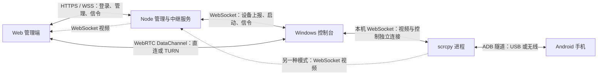

# Web 管理端与 scrcpy 控制台延迟优化方案

日期：2026-09-14  
分析基线：仓库提交 `a61e8c0`  
状态：第一轮代码实施完成（批次 A 的可观测性代码、B、C、D、E，详见第 14 节）；文中参数和验收目标为建议值，尚未经过线上真机验证。批次 A 的真机基线测量、批次 F/G 未实施。

## 1. 目标与实施边界

降低从浏览器触摸到手机画面变化被浏览器显示的时间，重点改善持续操作、拖动和弱网恢复。首屏启动时间单独统计，避免把启动优化当成持续交互优化。

本轮保留 Android H.264 编码、scrcpy 原始编码包转发、浏览器 WebCodecs 解码的主架构，优先修复本地发送、队列积压、编码配置和连接恢复。WebRTC 媒体轨道迁移作为后续评估项，不作为第一轮前置条件。

本文依据本地源码和已有日志。当前机器仅检测到 Android 模拟器，未测量线上 Windows 控制台、真实手机和浏览器之间的完整链路；实际部署版本、USB／无线 ADB、ICE 路由和可用带宽需要在实施第一步确认。

## 2. 当前连接架构



### 2.1 WebRTC 模式

- 视频：Android 屏幕捕获和编码 → ADB → scrcpy 编码包 → 本机 relay → DataChannel → 浏览器解码和 Canvas 绘制。
- 控制：浏览器触摸 → DataChannel → 控制台 → 本机控制 WebSocket → scrcpy 控制队列 → ADB → Android 输入注入。
- 公网 Node 服务负责设备管理和 WebRTC 信令；ICE 直连成功后，视频和触摸不需要通过它。
- TURN 是 WebRTC 的中继路径，与 Node 的 WebSocket 视频中继是两种不同模式。

### 2.2 WebSocket 模式与现有限制

源码保留 scrcpy → Node → 浏览器的视频中继和服务端控制路由，但前端触摸、按键当前只在 DataChannel 就绪时发送。控制台启用 WebRTC 后也取消了远端视频回退。因此，现状不能视为完整的自动回退实现。

前端打印“P2P 成功”的条件只是 PeerConnection 已连接，不能据此区分直连与 TURN。

### 2.3 已有优化应保留

- scrcpy 直接转发编码包，不进行 PC 端二次编码。
- 本机视频和控制使用独立 WebSocket 连接。
- scrcpy 主动连接端和 Node 端已设置 TCP_NODELAY。
- Node 禁用 WebSocket 消息压缩。
- 浏览器使用 `optimizeForLatency: true`，解码后直接绘制并释放 VideoFrame。
- 控制台启动 scrcpy 时关闭音频和本地视频播放。

## 3. 现有问题与优先级

| 编号 | 优先级 | 源码证据 | 影响及处理方向 |
|---|---|---|---|
| L01 | P0 | `local_video_relay.c` 的 `accept()` 后未设置 TCP_NODELAY；`ws_send_unmasked()` 分开发送头部和正文 | 存在小包等待的可能；补齐发送端设置并合并帧发送，收益通过实测确认 |
| L02 | P0 | `webrtc_support.c` 连续调用 `rtcSendMessage()`，未检查积压 | 网络变慢时可能持续发送旧画面；增加发送水位和过期处理 |
| L03 | P0 | `public/app.js` 持续调用 `videoDecoder.decode()` | 解码过载时没有追赶实时画面的策略；增加排队和帧龄监测 |
| L04 | P0 | 现有统计主要是帧数、接收字节；PTS 被替换为本地接收时间 | 缺少判断真实延迟和瓶颈的依据；先增加可观测性 |
| L05 | P1 | 首选启动命令不限制尺寸和码率，Android 默认码率为 8 Mbps | 增加画质档位和受控调参；不能假设所有手机都应降到 30 fps |
| L06 | P1 | `request_scrcpy_keyframe()` 发送 `resetVideo` | 请求关键帧会触发捕获和编码重置；增加轻量同步帧请求 |
| L07 | P1 | 同一 DataChannel 传视频和控制，默认可靠、有序 | 视频的旧数据可能因重传持续等待；后续分别设置视频和控制策略 |
| L08 | P1 | 无 P2P 时前端直接丢弃操作，控制台没有完整视频回退 | 会出现不可操作或假恢复；明确连接状态并实现端到端回退 |
| L09 | P1 | Node 默认允许约 8 MiB 发送积压，超限跳过当前视频数据 | 延迟预算过大，跳过参考帧后没有恢复机制；按观看者管理队列和关键帧恢复 |
| L10 | P2 | 高频 move 每次发送，scrcpy 每次打印控制 action | 合并待发送 move、减少日志，缓解高频输入压力 |

重要区别：视频与触摸主要沿相反方向传输，不能直接断言视频排队一定阻塞触摸。拆分 DataChannel 能独立设置策略，但同一 PeerConnection 内仍共享传输和拥塞资源。

## 4. 第一步：建立可比较的延迟基线

### 4.1 增加指标

| 指标 | 采集位置 | 用途与限制 |
|---|---|---|
| 实际连接路径 | 浏览器 `getStats()` 中被选中的 candidate pair | 显示直连／TURN，以及候选类型、协议；不要仅看 connected 状态 |
| ICE RTT | candidate pair 的 `currentRoundTripTime` | 反映选中路径的探测 RTT，不等于点击到画面的总耗时 |
| 应用控制 RTT | 浏览器发序号，控制台收到后回传 ACK | 包含应用调度和传输；ACK 仅表示控制台收到，不表示 Android 已执行 |
| 发送排队 | 控制台 `rtcGetBufferedAmount()`，Node `ws.bufferedAmount` | 判断发送积压；不覆盖传输层所有内部队列 |
| 解码排队 | `VideoDecoder.decodeQueueSize`、提交／输出的序号和时间 | 判断解码压力；队列计数不代表全部硬件解码耗时 |
| 绘制耗时 | 浏览器接收、解码提交、输出、绘制各阶段时间 | 定位浏览器开销；Canvas 调用结束不等于显示器已经呈现 |
| 首屏时间 | 点击选择设备到首张有效画面 | 与持续控制延迟分开统计 |
| 恢复时间 | 网络恢复／连接重建到第一张有效画面 | 评估关键帧和重连策略 |
| 实际码率、FPS、分辨率、编码器 | 控制台与浏览器 | 解释不同设备的性能差异，标记软件编码器回退 |

诊断信息放入可展开面板，每秒更新；普通界面仅显示连接类型和状态。正常运行不逐帧写日志，异常时记录原因、队列水位和恢复次数。

### 4.2 时间戳设计

第一阶段使用同一进程内的单调时钟计算各阶段耗时，应用控制 RTT 由浏览器单独计时，避免跨设备时钟误差。

协议升级后保留源端 PTS，并增加控制台发送时间和帧序号。Android PTS、Windows 单调时钟和浏览器 `performance.now()` 不共享时间原点，禁止直接相减计算端到端延迟。跨端测量需要时钟映射与误差估计，误差过大时只展示本地阶段耗时。

真实点击到画面延迟使用高帧率外部录像验证：同时拍摄实际按下动作及浏览器反馈，按录像帧数计算，并注明录像帧率带来的量化误差。调试 ACK 不能替代此项测量。

### 4.3 基线测试方法

1. 记录浏览器、控制台、scrcpy.exe、scrcpy-server 的版本或哈希，以及 libdatachannel 版本和 ICE 后端。
2. 固定手机、浏览器、画面内容、清晰度及网络条件，先热身 1 分钟。
3. 每组执行 100 次点击、持续拖动 60 秒、视频或滚动页面 5 分钟，至少重复 3 轮。
4. 收集 P50／P95 操作延迟、队列峰值、恢复时间、CPU 和丢帧原因。
5. 一次仅启用一个优化项，再进行组合测试；USB 与无线 ADB 分组，不混合统计。

## 5. 第二步：本地控制通道优化

涉及文件：

- `scrcpy-console/local_video_relay.c`
- `app/src/websocket_sink.c`
- `relay-server/public/app.js`

具体改动：

1. 本地 relay 对接受成功的连接设置 `setsockopt(IPPROTO_TCP, TCP_NODELAY, 1)`；失败时记录一次警告。优先保障控制发送方向。
2. 将小型控制 WebSocket 帧的头部和正文组合到同一个缓冲区，再调用完整发送函数；继续处理部分写入和失败返回。
3. 为每个控制 socket 增加发送串行化。触摸回调与视频线程的关键帧请求都可能写同一个连接，必须避免帧之间交错；锁粒度限定为完整单帧发送，并处理连接关闭的并发情况。
4. 将 `Received control action: touch` 降为 DEBUG 或采样日志，保留错误及必要状态变化。
5. 首轮不增加固定的触摸发送等待。测量显示高频 move 积压后，再只保留尚未发送的最新 move。
6. down、up、cancel 和按键必须保序可靠；发送 up 前处理当前待发 move，断开时清理手势状态，避免卡在按下状态。

验收：连续点击、长按、拖动和越界释放正常；并发关键帧请求与触摸时不产生协议解析错误；至少 1,000 次手势无遗漏释放。TCP 改动收益以同网络条件下 P50／P95 对照为准。

回退：提供控制台开关关闭新增 TCP 参数；帧完整发送与发送串行化属于正确性保证，不以牺牲帧完整性进行性能回退。

## 6. 第三步：增加编码档位

涉及文件：`scrcpy-console/scrcpy_console.c`、前端档位选择、Node 启动参数校验。

| 档位 | 最大边长 | 目标码率 | 最大 FPS | 用途 |
|---|---:|---:|---:|---|
| 原有配置 | 不主动限制 | 8 Mbps | 不额外限制 | 对照基线及回退 |
| 交互优先 | 1280 | 4 Mbps | 60 | 第一轮低延迟试验 |
| 弱网 | 1024 | 2 Mbps | 30 | 带宽不足时使用 |
| 清晰优先 | 1920 | 6 Mbps | 60 | 带宽和解码能力充足时使用 |

上述参数是试验起点，最大边长不是固定横屏宽度，码率也不是实际网络流量的硬上限。保留设备编码兼容性回退，不把软件编码器作为性能优化选项。

交互优先启动命令示例：

```text
scrcpy.exe -s <serial> --websocket-server=<host:port> --no-video-playback --no-audio --max-size=1280 --video-bit-rate=4M --max-fps=60 --video-codec-options profile:int=1
```

实现要求：

- 档位转换为固定白名单参数，不接收浏览器提供的任意命令行字符串。
- 第一版明确提示切换画质需要重启视频；保留所选设备，但不得伪装成无缝切换。
- 记录最终启动成功的参数和实际编码器；UI 区分目标 FPS 与实际 FPS。
- 自动调码率放在队列指标稳定后实施：持续拥塞时降档，连续稳定后缓慢恢复，避免频繁升降。
- 动态码率可评估 MediaCodec 运行时参数；改变尺寸通常需要重建捕获和编码链路，不能每次短抖动都重启。

## 7. 第四步：轻量关键帧请求与视频协议

这一步是安全丢弃压缩帧和可靠恢复的基础，应先于主动丢帧策略上线。

### 7.1 将请求关键帧与重置视频分开

当前路径：`requestKeyFrame / resetVideo` → scrcpy `RESET_VIDEO` → Android 捕获失效 → 编码循环重新配置。

目标路径：新增独立关键帧请求 → Android 在有效 MediaCodec 实例上调用 `setParameters()`，设置 `PARAMETER_KEY_REQUEST_SYNC_FRAME`。完整重置继续处理旋转、尺寸改变和编码异常。

涉及文件：

- `app/src/control_msg.h`、`app/src/control_msg.c`、`app/src/websocket_sink.c`
- `server/src/main/java/com/genymobile/scrcpy/control/ControlMessage.java`
- `server/src/main/java/com/genymobile/scrcpy/control/ControlMessageReader.java`
- `server/src/main/java/com/genymobile/scrcpy/control/Controller.java`
- `server/src/main/java/com/genymobile/scrcpy/video/SurfaceEncoder.java`
- `scrcpy-console/local_video_relay.c`

要求：

1. C 与 Java 控制协议同时更新；新增消息编号需检查冲突，不能修改旧 `RESET_VIDEO` 编号和语义。
2. 给运行中的编码器提供线程安全请求入口，处理请求与 codec 停止／重置／释放的竞争。
3. 合并重复请求，初始建议最短间隔 500 ms；请求后实际观察 IDR，而不是收到 ACK 就认为成功。
4. 建议 1 秒内未观察到 IDR 时允许一次完整重置；重复失败进入明确的重连或失败状态，避免重置循环。
5. 新能力必须随版本协商；旧 scrcpy-server 只使用原重置方案。打包时同步更新 scrcpy.exe 和 scrcpy-server。
6. 可试验把周期 IDR 间隔从当前 10 秒缩短为 2 秒，比较码率峰值后决定，不能以缩短 GOP 代替按需请求。

### 7.2 明确帧边界并保留时间信息

当前 WebRTC 分片只有 magic、起止标记和 frameId，没有分片索引或完整性校验；浏览器只维护一个正在组装的帧。前端还将各个 slice NAL 分别提交给解码器，不能假定一个 NAL 永远等于一张完整图像。

建议设计带版本号的消息封装，按完整 H.264 access unit 提交解码：

| 字段 | 作用 |
|---|---|
| version / messageType | 区分视频、配置、控制 ACK 和统计；旧客户端拒绝不支持版本 |
| streamEpoch | 重启、重连、换设备、编码配置变化时递增，拒绝旧流残留消息 |
| frameSeq / configVersion | 标识编码帧及其 SPS／PPS 配置 |
| flags | 标识配置、关键帧和普通帧 |
| sourcePts / senderTime | 保留源 PTS 和控制台时间；使用时注明各自的时钟域 |
| chunkIndex / chunkCount / totalLength | 检测分片缺失、乱序、重复及长度异常 |

先验证 demuxer 输出的 packet 与 access unit 边界；若不一致，在转发端聚合完整 access unit。AVCC 转换需保留同一 access unit 内的所有 slice。SPS／PPS 有变化时更新配置，避免不断追加到历史数组。

第一版仍使用可靠、有序 DataChannel，先让协议和恢复可验证。分片尺寸可比较 16 KiB、32 KiB 和现有 60 KiB，不以“越小越快”作为结论，并遵守协商后的最大消息大小。

## 8. 第五步：治理发送与解码积压

### 8.1 控制台发送状态机

```text
WAIT_CHANNEL → WAIT_CONFIG_IDR → STREAMING
STREAMING → CONGESTED → WAIT_CONFIG_IDR → STREAMING
任意状态 → DISCONNECTED / FAILED
```

建议初始策略：

1. 每个完整 access unit 入队前读取 DataChannel 发送水位，记录队列最老帧等待时间。
2. 水位预算参考 `目标码率 × 排队预算 / 8`；以 4 Mbps、100 ms 为例约为 50 KB。它是量级估计，不是适合所有关键帧的固定硬限制。
3. 区分普通帧预算和关键帧临时预算。关键帧允许受限突发，并受最大帧大小和绝对内存上限约束，避免关键帧始终无法发送。
4. 连续超过预算时降码率；需要跳过压缩帧时进入 `WAIT_CONFIG_IDR`，继续读走上游数据但停止提交后续依赖帧，合并关键帧请求。
5. 队列恢复后，仅从匹配配置的完整新 IDR 恢复，并通知浏览器当前 epoch 和恢复状态。
6. 已交给可靠 DataChannel 的旧数据无法通过清空应用数组撤回。持续积压超过硬时限，例如 1 秒时，应按状态机重建传输并使用新 epoch；必须先实测重建成本。
7. 任何发送中途失败都按整帧失败处理，后续重新等待配置和 IDR，不能继续假定参考链完整。

恢复请求和指标反馈应走不受旧视频下行队列拖累的反向控制路径。发送水位不覆盖全部内核／SCTP 队列，因此需要结合应用 ACK、帧龄和实测表现判断。

### 8.2 浏览器解码与绘制

- 监测 `decodeQueueSize`，建议以连续达到 3～4 个 access unit 作为早期压力信号，结合最近输出速度判断，避免对单次波动重置。
- 正常情况下保持解码后立即绘制；主线程压力大时可试验每次绘制仅保留最新的已解码 VideoFrame，并及时关闭被替换帧。
- 已解码帧可跳过显示；压缩参考帧不可随意跳过后继续解码其依赖帧。
- 持续过载时重置／重新配置解码器，请求新 IDR，并拒绝旧 epoch 数据；reset 后必须重新 configure，再从关键帧开始。
- 不通过 `flush()` 追赶实时画面，因为 flush 主要用于排空解码工作，不会自动清除网络积压。
- 后台标签页恢复时检查帧龄和 epoch，必要时请求新关键帧；避免回放后台期间的旧帧。
- 若采用 Worker／OffscreenCanvas，再单独评估浏览器兼容性和消息转移成本，不作为首轮必改项。

### 8.3 视频与控制通道拆分

协议和恢复稳定后增加独立通道：

- `control`：可靠、有序，承载 down／up／cancel、按键、关键帧请求和必要 ACK。
- `video`：先保持可靠、有序；有完整重组、丢失检测和参考链恢复后，才试验有限重传／有限生存时间。
- move 第一版仍在 control 中保序发送，只合并尚未发送的数据，避免跨通道破坏手势顺序。
- 前端按 label 绑定通道，不能继续把最后收到的 DataChannel 无条件覆盖为全局唯一通道。

拆通道不意味着视频与控制具备完全独立的带宽，也不保证弱网延迟自动消失。

## 9. 第六步：连接路径、TURN 与回退

### 9.1 路由诊断与 TURN 配置

- 读取已选中的 ICE 路径，明确显示“WebRTC 直连”“WebRTC TURN 中继”“WebSocket 中继”。
- 检查控制台实际编译是否启用 `USE_WEBRTC`，以及运行时库和源码版本是否匹配。
- 当前控制台 TURN URL 采用 `turn:<host> <username> <password>` 拼接；按 libdatachannel 文档核对 URI 格式，正确编码凭据中的保留字符。
- 对齐浏览器和控制台 TURN 配置来源及凭据生命周期；服务端 PM2 示例未显式开启 TURN，不代表线上已启用。
- 验证实际网络中的 STUN 可达性，不预设某个公共 STUN 在所有网络都可用。
- UDP 优先；是否支持 TURN TCP／TLS 需核对所使用的 ICE 后端和实际构建，不能只在前端添加 URL 就认为可用。

### 9.2 明确回退状态机

```text
CONNECTING_RTC → RTC_DIRECT / RTC_RELAY
CONNECTING_RTC → CONNECTING_WS → WS_ACTIVE
ACTIVE → RECOVERING → ACTIVE / FAILED
```

建议首次 ICE 等待预算从 5 秒开始测试。此值只用于启动和失败恢复，不用于给每条控制消息增加等待。

落地要求：

1. 只有 DataChannel 打开、控制本地连接就绪并收到可解码首帧后，才显示“可控制”；连接成功与视频可用分别记录。
2. 由一个明确的状态机决定当前控制路由，不同时向 WebRTC 和 WebSocket 双发触摸，避免重复点击。
3. WebSocket 回退必须同时建立视频与控制路径，可复用 scrcpy 远端启动目标，但需通知用户切换期间会短暂重建视频。
4. 每次切换递增 epoch，取消旧握手和超时任务，避免旧回调覆盖新状态。
5. 为切换设置冷却时间，避免网络抖动导致 WebRTC 与 WebSocket 来回切换。
6. 不重放断开期间积累的点击和滑动；恢复到明确的释放状态，确保旧手势结束。
7. UI 显示“正在恢复”“视频已连接，控制未就绪”或明确失败原因，而不是静默丢弃输入。

### 9.3 WebSocket 中继的低延迟策略

Node 目前默认 8 MiB 缓冲仅能粗略限制积压。以 8 Mbps 排空速度估算，该数据量约为 8.4 秒，不是实时交互适合的排队预算，也不表示系统始终有 8.4 秒延迟。

使用与 WebRTC 一致的帧封装和关键帧恢复机制，对每个观看者独立管理状态；慢观看者不阻塞其他观看者。阈值按码率和等待时间设置，并为关键帧保留临时预算。超限后跳过后续依赖帧，等待配置和新 IDR；已经交给 TCP 的旧数据无法撤回，持续积压时重建该观看者连接。

关键帧请求按设备合并，避免多个慢观看者反复触发编码重置。第一轮不尝试通过扩大 Node 内存或多实例部署解决单连接排队延迟。

## 10. 建议拆分的实施批次

| 批次 | 内容 | 依赖 | 交付与完成条件 |
|---|---|---|---|
| A | 版本核对、链路指标、测试基线 | 无 | 能区分直连／TURN／WS，得到真机基线报告 |
| B | TCP_NODELAY、完整帧发送、写入串行化、日志降频 | A | 手势可靠性通过，完成延迟对照 |
| C | 编码档位、参数白名单、最终参数展示 | A | 三档画质完成 USB／无线对照，可恢复原配置 |
| D | 轻量关键帧、协议版本、epoch、access unit 边界 | A | 新旧版本行为明确，重连和配置变化可恢复 |
| E | 发送与解码背压、过载恢复 | C、D | 限速下不持续回放旧视频，恢复时间达到目标 |
| F | 通道拆分、TURN 校验、完整 WS 回退 | D、E | 断网、穿透失败、切换期间无重复操作 |
| G | 自动码率、有限重传实验、Worker 或媒体轨道评估 | 前述指标稳定 | 只有对照收益明确时才进入正式发布 |

首个可发布版本建议只包含 A、B、C。D、E 需要修改协议和 Android 端，单独构建并验证；不要将未经验证的压缩帧丢弃策略混入首个版本。

## 11. 验收矩阵与目标

下列数值是实施目标，不是对所有公网环境的延迟承诺。绝对延迟目标在批次 A 获得真实基线后补充，保留网络 RTT 和设备编码性能的影响。

| 场景 | 测试动作 | 验收要求 |
|---|---|---|
| USB + 局域网直连 | 点击、长按、持续拖动 | 无输入语义回归；P95 不明显恶化；新增机制的收益超出测试噪声 |
| 无线 ADB + 局域网直连 | 同上，与 USB 分开记录 | 明确 ADB 无线链路的额外影响，不混入 WebRTC 优化收益 |
| 公网直连 | 固定档位操作 5 分钟 | 记录实际 ICE RTT；延迟不随运行时间持续增长 |
| TURN | 强制走 relay 后重复测试 | 能正确识别 relay 路径；记录 TURN 协议和位置 |
| 带宽不足 | 4 Mbps 档位，限速至 2 Mbps，持续 60 秒后恢复 | 触发降码率或明确恢复；不继续增长旧视频积压；恢复带宽后目标 2 秒内回到稳定画面 |
| 丢包和抖动 | 0%、1%、3% 丢包；固定 RTT 后增加抖动 | 不持续花屏；记录 P95 和重连次数；有限重传版本不劣于可靠版本的可用性 |
| 连接中断 | 中断 3 秒、10 秒后恢复 | 无重复点击、无卡住的按下状态；失败或恢复状态明确 |
| 浏览器过载 | 降低 CPU 配额、后台停留后返回 | 无无界 VideoFrame／NAL 缓存；能够从新 IDR 恢复 |
| 多观看者 | 快客户端和限速客户端同时观看 | 慢客户端不拖累快客户端；若现有 RTC 多观看者能力不支持，明确限制并独立立项 |
| 配置变化 | 旋转、改画质、快速切设备 | epoch 与解码配置正确，旧帧不覆盖新设备画面 |

建议验收预算：发送应用队列稳定时通常不超过约 100 ms；浏览器应用侧待解码积压通常保持在 2 个 access unit 以内。它们都是监控目标，不代表包含网络和硬件内部队列的总延迟。

性能回归判定应结合至少三轮测试的波动区间；若单项收益小于录像量化误差或重复测试波动，不宣称该项已降低延迟。

## 12. 自动化验证与发布回退

### 12.1 必需验证

- 分片协议：分片缺失、乱序、重复、超长、epoch 变化、配置切换，验证完整 access unit 才被提交。
- 控制发送：部分写入、连接关闭、触摸与关键帧请求并发，验证 WebSocket 帧不交错。
- 状态机：握手超时、旧回调、快速切设备、RTC 转 WS，验证只存在一个有效控制路由。
- 解码恢复：reset 后重新 configure；先配置与 IDR，再接受依赖帧；VideoFrame 被及时释放。
- C／Java 控制协议：新增消息在两端编号和解析一致，未知能力不发送给旧端。
- 限速集成测试与真机录像：用于验证真实延迟和恢复，不能由模拟单元测试替代。

### 12.2 构建与发布顺序

1. 先部署兼容旧协议的管理端指标；新增字段默认可选。
2. 使用 `scrcpy-console/build-mingw.sh webrtc` 或 Windows 的 `build.bat webrtc` 构建控制台，确认 libdatachannel 版本、ICE 后端和运行库打包完整。
3. 修改 Android 控制协议时，同步构建 scrcpy.exe 和 scrcpy-server。构建路径以仓库 `release/` 脚本和实际工具链为准，不混用历史二进制。
4. 新协议、新关键帧能力、背压策略和自动回退通过能力协商及开关启用，先在单台真机上验证。
5. 再扩大到不同 Android 版本、不同编码器和不同网络；每批保留上一版本二进制与配置。

### 12.3 回退条件

出现重复点击、遗漏 up／cancel、解码持续失败、恢复循环或明显 P95 回退时，关闭对应实验功能并回到上一稳定版本。恢复协议版本必须同步恢复相关前端、控制台、scrcpy.exe 和 scrcpy-server，不能只替换其中一个组件。

建议新增的实验开关（当前代码尚不存在）：

```text
LATENCY_METRICS_ENABLED
LOCAL_CONTROL_TCP_NODELAY
VIDEO_PROFILE
VIDEO_PROTOCOL_V2
VIDEO_BACKPRESSURE_ENABLED
SEPARATE_CONTROL_CHANNEL
AUTO_TRANSPORT_FALLBACK
ADAPTIVE_BITRATE_ENABLED
```

实现时明确每个开关归属前端、Node、控制台还是 Android；不要假定设置 Node 环境变量会自动改变控制台行为。能力协商失败时回到双方共同支持的功能集合。

## 13. 依据与后续记录

主要源码入口：

- Web 管理端：`relay-server/public/app.js`
- Node 中继：`relay-server/server.js`
- 信令与 TURN：`relay-server/webrtc-signaling.js`、`relay-server/turn-server.js`
- 控制台启动：`scrcpy-console/scrcpy_console.c`
- WebRTC 传输：`scrcpy-console/webrtc_support.c`
- 本地 relay：`scrcpy-console/local_video_relay.c`
- scrcpy 视频与控制：`app/src/websocket_sink.c`、`app/src/controller.c`
- Android 编码：`server/src/main/java/com/genymobile/scrcpy/video/SurfaceEncoder.java`

外部接口依据：

- [libdatachannel C API](https://libdatachannel.org/pages/reference.html)：默认可靠有序通道、发送缓冲、最大消息大小、TURN URI 和 ICE 后端限制。
- [WebRTC Stats](https://www.w3.org/TR/webrtc-stats/)：选中候选路径和 RTT 统计。
- [WebCodecs](https://www.w3.org/TR/webcodecs/)：解码队列、配置、重置和关键帧要求。
- [Android MediaCodec](https://developer.android.com/reference/android/media/MediaCodec#PARAMETER_KEY_REQUEST_SYNC_FRAME)：运行时请求同步帧。

实施时在本文追加每批次的实测环境、参数、版本、P50／P95、恢复时间和最终决策，保留无收益或回退项目的记录。

## 14. 实施记录（2026-09-14，第一轮代码）

本轮在无真机环境下完成代码实施与构建验证；所有收益结论待批次 A 真机基线对照后填写。

### 14.1 已实施内容

| 批次 | 内容 | 涉及文件 | 状态 |
|---|---|---|---|
| A（代码部分） | 链路可观测性：getStats 选中候选对/ICE RTT、解码队列采样、绘制/首帧耗时、控制台指标经 DataChannel 推送（每 2 秒）、可折叠诊断面板 | `relay-server/public/app.js`、`index.html`、`scrcpy-console/webrtc_support.c`、`local_video_relay.c` | 已实施，未实测 |
| B | accept 后设置 TCP_NODELAY（开关 `LOCAL_CONTROL_TCP_NODELAY`）；ws_send_unmasked 头部+正文合并单次发送；控制连接发送串行化（CRITICAL_SECTION，覆盖触摸转发、关键帧请求、连接关闭并发）；`Received control action` 降为 DEBUG | `scrcpy-console/local_video_relay.c`、`app/src/websocket_sink.c` | 已实施，编译通过 |
| C | 画质档位白名单（original/interactive/weaknet/sharp，参数固定不接收任意字符串）；`VIDEO_PROFILE` 环境变量锁定；前端档位选择器（切换需重启视频，明确提示）；`startStreaming` 上报实际生效档位与参数；Node 白名单校验转发 | `scrcpy-console/scrcpy_console.c`、`relay-server/server.js`、`public/app.js`、`index.html` | 已实施，编译通过；三档画质 USB/无线对照未做 |
| D | 轻量关键帧：新增控制协议类型 18 `requestSyncFrame`（C 枚举 + Java `TYPE_REQUEST_SYNC_FRAME`），Android 侧 `CaptureReset.requestSyncFrame()` 在运行中的 MediaCodec 上 `setParameters(PARAMETER_KEY_REQUEST_SYNC_FRAME)`，与 codec 停止/重置通过同一把锁互斥；转发端 500ms 合并重复请求，连续约 1 秒未观察 IDR 回退一次 `RESET_VIDEO`，连续 6 轮失败停止请求避免重置循环；`RESET_VIDEO` 编号与语义未改动 | `app/src/control_msg.h/.c`、`websocket_sink.c`、`server/.../ControlMessage.java`、`ControlMessageReader.java`、`Controller.java`、`SurfaceCapture.java`、`CaptureReset.java`、`scrcpy-console/local_video_relay.c` | 已实施；scrcpy-server 已重新构建并同步（见 14.2） |
| E | 发送水位背压：`webrtc_send_video` 帧入队前检查 `rtcGetBufferedAmount`，超过预算（档位码率 × 100ms / 8，original 默认 100KB）即整帧丢弃并进入等待配置+IDR 状态；浏览器解码过载恢复（连续采样 decodeQueueSize ≥ 4 触发 reset + 重新 configure + 请求新 IDR，不使用 flush）；后台标签页恢复帧龄检查；Node 观看者独立队列（`VIEWER_MAX_BUFFERED_AMOUNT` 默认 1MiB，超限跳过普通帧 + 请求关键帧，检测到新 IDR 恢复，5 秒未生效回退一次完整重置） | `scrcpy-console/webrtc_support.c/.h`、`local_video_relay.c`、`relay-server/public/app.js`、`relay-server/server.js` | 已实施，编译通过；限速场景验收未做 |
| 9.1（部分） | TURN URI 修正为 libdatachannel 标准格式 `turn:<user>:<pass>@<host>?transport=udp`，凭据保留字符百分号编码（原 `turn:host user pass` 空格拼接无法解析） | `scrcpy-console/webrtc_support.c` | 已实施；实际穿透验证未做 |

### 14.2 构建与部署说明

- 本轮验证环境：macOS darwin 25.5.0 arm64；`x86_64-w64-mingw32-gcc (MinGW-w64 14.0.0)`；OpenJDK 21 + `server/build_without_gradle.sh`（ANDROID_PLATFORM=36，build-tools 36.0.0）。
- `scrcpy-console/local_video_relay.c`、`webrtc_support.c`、`scrcpy_console.c` 均以 `-DUSE_WEBRTC`（对真实 libdatachannel rtc.h）与非 WebRTC 两种模式完成语法/编译检查，无错误。**最终 Windows 可执行文件需在构建机执行 `build-mingw.sh webrtc` 或 `build.bat webrtc` 重新生成**（本机无 libdatachannel 库文件，无法链接）。
- `scrcpy-server` 已按新协议重新构建，并已同步替换 `scrcpy-console/scrcpy-server`（sha1 `94b8e7e453eddd7038a1854c207b48c09a02aaa6`，android-36 编译）。
- Node 端 `node --check` 通过，且本地启动冒烟测试通过（HTTP 200 / 设备列表服务正常）。
- **部署顺序要求**：新 scrcpy.exe 必须与新 scrcpy-server 同时部署（新增控制动作 `requestSyncFrame` 需两端同时支持）。若必须混用旧 scrcpy-server，设置环境变量 `SCRCPY_KEYFRAME_SYNC=0` 回退旧的 resetVideo 方案。

### 14.3 新增开关与默认值

| 开关 | 归属 | 默认 | 说明 |
|---|---|---|---|
| `LOCAL_CONTROL_TCP_NODELAY` | 控制台 | 1（启用） | 置 0 关闭 TCP_NODELAY，用于收益对照 |
| `SCRCPY_KEYFRAME_SYNC` | 控制台 | 1（启用） | 置 0 回退 resetVideo；旧 scrcpy-server 必须置 0 |
| `VIDEO_PROFILE` | 控制台 | 空（由浏览器档位决定，缺省 original） | 强制锁定档位（白名单值） |
| `VIEWER_MAX_BUFFERED_AMOUNT` | Node | 1 MiB | 观看者积压阈值；`MAX_WS_BUFFERED_AMOUNT`（8 MiB）保留为硬上限 |

### 14.4 代码审计与修复（2026-09-14，同日第二轮）

第一轮实施后对全量 diff 做了一次代码审计，发现并修复以下问题：

| 级别 | 问题 | 修复 |
|---|---|---|
| P2 | TURN URI 在长凭据+长 host 组合下被 snprintf 静默截断（`turn_url[512]` 最坏需约 1040 字节），生成非法 URI 且无日志，TURN 静默失效 | 缓冲扩至 1280 并按结构体字段上限论证；增加 snprintf 返回值截断检测，超限时打印 ERROR 并跳过该 ICE server；编码缓冲同步扩至 512 |
| P2 | 浏览器过载恢复用旧 `lastDecoderConfig` 立即 reconfigure，此后带内新 SPS/PPS 因 decoder 已 configured 被忽略；过载期间若发生旋转/改分辨率将持续解码失败 | `decodeH264Data` 的 SPS/PPS 分支改为：配置齐备后与现行配置逐字节比较，仅参数变化才重配置（同时修复 nalBuffer 历史无限追加）；`recoverFromDecoderOverload` reset 后不再立即用旧配置，优先等待流内 SPS/PPS，2 秒兜底定时器才用旧配置 |
| P3 | 控制通道失效时每 500ms 打一条 WARN | 发送失败告警单次化（成功后复位），覆盖同步帧与 reset 两条路径 |
| P3 | 非 WebRTC 构建引入 `version_before_launch` 未用变量警告 | 声明移入 `#ifdef USE_WEBRTC` |
| P3 | Node 观看者背压 `skipStartAt` 字段只写不读 | 移除 |
| P3 | 档位日志参数粘连 | 分隔符修正，空参数显示"(不主动限制)" |

审计确认项：C/Java 协议类型编号一致（18）；控制发送临界区无嵌套、持锁时长受 SO_SNDTIMEO 约束，无死锁；水位超限→等待 IDR→IDR 到达无条件重试的恢复路径无卡死；档位白名单无注入面；`containsH264Idr` 行为测试通过（对不合规格流的误报后果仅为提前恢复发送）。

### 14.5 待办与遗留

- 批次 A 的真机基线测量（4.2/4.3 节方法：外部录像法、限速矩阵、USB/无线分组）未执行；诊断面板数据可作为采集来源。
- 批次 C 的三档画质 USB/无线对照、批次 D 的 IDR 观察回退实测、批次 E 的限速恢复验收（目标：恢复带宽后 2 秒内回到稳定画面）均未验证。
- 批次 F（通道拆分、完整 WS 回退状态机）与批次 G（自动码率、有限重传）未实施。
- 帧封装协议 v2（7.2 节：epoch/frameSeq/chunkIndex/sourcePts）未实施；当前浏览器 epoch 仅在应用层用于拒绝旧 DataChannel 回调数据。
- 高频 move 合并（L10）按方案首轮决策未加入，待测量确认 move 积压后再实施。
