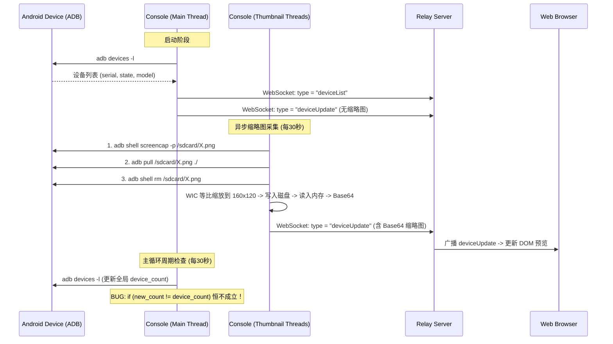
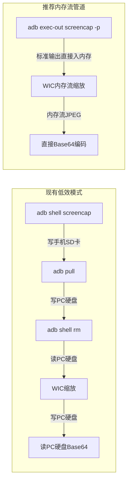
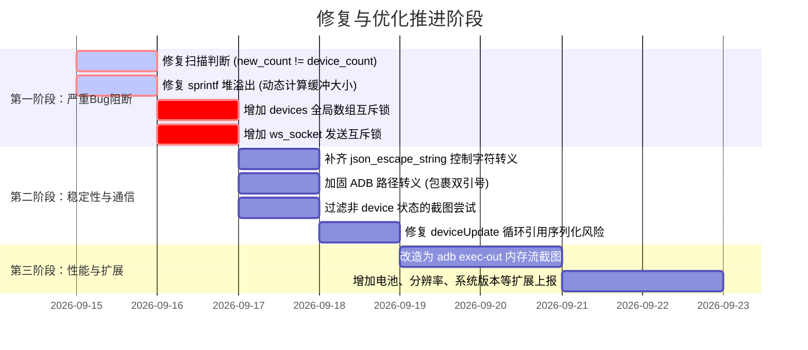

# scrcpy-console 设备读取与信息上报审计报告

> **审计对象**：`scrcpy-console` (Windows C 客户端) 及其与 `relay-server` (Node.js) / `Web Client` 的协同链路  
> **核心关注**：ADB 设备检测、状态与属性读取、缩略图截取管线、WebSocket 信息上报、线程安全与并发控制  
> **分析时间**：2026-09-14  

---

## 一、 审计摘要与总体评价

通过对 `scrcpy-console/scrcpy_console.c`、`relay-server/server.js` 以及前端 `relay-server/public/app.js` 完整链路的深度代码审计，控制台端设备读取与信息上报模块整体具备了基本的设备识别、WIC 图片压缩缩放和 WebSocket 上报能力。

然而，在**逻辑闭环、内存安全、并发线程安全、I/O 效率及协议健壮性**方面存在多个显著缺陷与严重 Bug：

| 缺陷类别 | 严重程度 | 问题简述 | 影响范围 |
|---|---|---|---|
| **逻辑死锁/致盲** | 🚨 **严重 (Critical)** | `new_count != device_count` 永真为假，周期性设备扫描即使发现插拔也**绝不上报** | 设备热插拔无法感知 |
| **内存溢出** | 🚨 **严重 (Critical)** | `sprintf` 将最大 136KB 的 Base64 写入 80KB 堆缓冲区，引发堆破坏与崩溃 | 缩略图生成时崩溃 |
| **并发数据竞争** | 🚨 **严重 (Critical)** | 全局 `devices` 数组在多线程间无互斥保护并发读写（主线程 vs 截图工作线程） | 野指针、段错误、UAF |
| **网络帧损坏** | 🔴 **高危 (High)** | `ws_socket` 被主线程与后台线程无锁并发调用 `send()`，WebSocket 帧交错损毁 | 造成服务端断开连接 |
| **内存泄漏** | 🟠 **中危 (Medium)** | 设备下线或重新排序时，旧 `thumbnail_base64` 内存未被释放即被覆盖或丢弃 | 长期运行内存持续增长 |
| **JSON 规范违规** | 🟠 **中危 (Medium)** | `json_escape_string` 仅转义引号与反斜杠，未转义 `\r`/`\n` 等控制字符 | 服务端 `JSON.parse` 抛错 |
| **ADB 路径未转义** | 🟠 **中危 (Medium)** | 路径含空格（如 `Program Files`）时 `system` / `_popen` 解析断裂 | 控制台无法执行 ADB 指令 |
| **无用 I/O 开销** | 🟡 **可优化 (Perf)** | 截图采用 `screencap -> pull -> rm` 3 次进程启动 + 硬盘写入读出，造成高磁盘与闪存开销 | 性能低下、设备磨损 |
| **信息维度单一** | 💡 **可优化 (Feature)** | 仅上报 model/serial，缺少分辨率、系统版本、电池电量、连接类型 (USB/Wi-Fi) | 用户端体验与运维能力不足 |

---

## 二、 现有实现架构与数据流溯源



---

## 三、 关键 Bug 深度剖析

### 1. 【严重逻辑缺陷】周期性扫描设备变更后永远无法上报

- **定位代码**：`scrcpy-console/scrcpy_console.c` 第 797、880、889 行 与 第 1883~1887 行
- **缺陷代码分析**：
  ```c
  // scan_adb_devices() 内部实现：
  int scan_adb_devices() {
      ...
      device_count = 0;  // 直接将全局变量重置为 0
      while (...) {
          ...
          device_count++; // 直接自增全局变量
      }
      return device_count; // 返回全局变量
  }

  // console_loop() 内部检测：
  int new_count = scan_adb_devices();
  if (new_count != device_count) {   // 致命问题：此时 new_count 与 device_count 恒等！
      print_log("INFO", "设备列表已更新");
      send_device_list();  // 此代码永远不会被执行！
  }
  ```
- **后果**：
  控制台启动后，后续用户无论**插上新手机**还是**拔掉旧手机**，`if (new_count != device_count)` 永远为 `false`。控制台内部即便扫描到了变化，也**绝不会向服务端发送 `deviceList`**，导致服务端和 Web 前端显示的设备列表永久冻结在启动时的状态。
- **关联缺陷**：
  即便修复为 `old_count != new_count`，单纯比对数量也存在漏洞：当一台设备拔出、另一台设备插入时，设备总数未变，但序列号发生变化；或者设备从未授权状态（`unauthorized`）变为授权状态（`device`），数量也未变，单纯比对计数都会漏报。

---

### 2. 【高危内存漏洞】堆缓冲区溢出（Heap Buffer Overflow）

- **定位代码**：`scrcpy-console/scrcpy_console.c` 第 959~976 行、第 2282~2299 行、第 2241~2261 行
- **缺陷代码分析**：
  ```c
  // 1. 缩略图大小上限定义为 100KB (102400 字节)：
  if (thumb_size > 100 * 1024) { return; }
  size_t b64_size = ((thumb_size + 2) / 3) * 4 + 1; // 最大可达 136,534 字节

  // 2. 发送消息分配的缓冲区仅为 BUFFER_SIZE * 10：
  // BUFFER_SIZE 为 8192，8192 * 10 = 81,920 字节 (80KB)
  char* message = (char*)malloc(BUFFER_SIZE * 10);

  // 3. 无边界格式化写入：
  sprintf(message,
      "{\"type\":\"deviceUpdate\",\"device\":{\"serial\":\"%s\",\"state\":\"%s\",\"model\":\"%s\",\"customName\":\"%s\",\"thumbnail\":\"%s\"}}",
      escaped_serial, devices[i].state, escaped_model, escaped_name,
      devices[i].thumbnail_base64 ? devices[i].thumbnail_base64 : "");
  ```
- **后果**：
  当设备屏幕内容复杂（彩色壁纸、照片、复杂界面），经 WIC 压缩后的 JPEG 大小达到 60KB~100KB 时，Base64 字符串长度将达到 80KB~136KB。`sprintf` 会直接溢出分配的 80KB 堆内存，**篡改相邻堆块元数据，引发不可预期的内存崩溃（Access Violation）或程序被操作系统强行杀死**。

---

### 3. 【高危并发漏洞】多线程直接读写全局 `devices` 数组缺少互斥保护

- **定位代码**：`scrcpy-console/scrcpy_console.c`
- **冲突现场**：
  1. **主线程**：`scan_adb_devices()` 在 `console_loop` 中定期执行，执行时直接执行 `device_count = 0`，随后循环覆写 `devices[i]` 的 `serial`、`state`、`model`。
  2. **后台工作线程**：`thumbnail_update_thread` 及并发子线程 `capture_screenshot_thread` 读取 `devices[device_index]` 进行截图与 Base64 编码，并执行：
     ```c
     if (device->thumbnail_base64) free(device->thumbnail_base64);
     device->thumbnail_base64 = (char*)malloc(b64_size);
     ```
  3. **数据发送线程**：`send_updated_device_list()` 遍历 `device_count` 并读取 `devices[i].thumbnail_base64`。
- **后果**：
  全局变量 `devices` 与 `device_count` **没有任何互斥锁（Mutex / CRITICAL_SECTION）保护**（现有的 `thumbnail_cs` 仅仅保护了一个布尔标志 `thumbnail_update_pending`）。当后台线程正在读取某设备的截图时，主线程扫描突然把 `device_count` 置 0 并覆写 `devices[i]`，将导致：
  - 数组越界访问；
  - 正在使用的指针被释放导致 Use-After-Free；
  - 多线程同时 `malloc`/`free` 导致堆破坏。

---

### 4. 【通信致命漏洞】`ws_socket` 并发调用 `send()` 引发 WebSocket 帧损毁

- **定位代码**：`scrcpy-console/scrcpy_console.c` 第 458 行、第 1868 行、第 2303 行
- **缺陷分析**：
  - 主线程在 `console_loop()` 中响应服务端 Ping 帧发送 Pong（`send(ws_socket, ...)`），并在收到各种控制指令时调用 `send_websocket_message()`；
  - 后台线程 `thumbnail_update_thread` 在缩略图更新完毕后调用 `send_updated_device_list()`，连续多次调用 `send_websocket_message()` 发送大体积帧；
  - **Winsock 的 TCP Socket 发送在多线程无保护并发下是非原子的**。大包切片发送时，如果另一个线程同时调用 `send()`，两个不同帧的数据字节流将在 TCP 流中**交叉混杂**。
- **后果**：
  中继服务器解析到损毁的 WebSocket 数据帧（如非法的 Opcode 或长度字段越界），直接报错并关闭连接，导致控制台掉线重连。

---

### 5. 【内存泄漏与野指针】设备变动时 `thumbnail_base64` 内存遗失与错位

- **定位代码**：`scrcpy-console/scrcpy_console.c` 第 710~716 行、第 797~881 行
- **缺陷分析**：
  `free_device_thumbnails()` 仅在控制台进程退出（`cleanup`）时被调用一次。
  当每次执行 `scan_adb_devices()` 时：
  - 数组下表被直接重新赋值；
  - 原来分配给旧设备的 `thumbnail_base64` 堆指针没有释放；
  - 如果设备 A 拔出，设备 B 占用了索引 0，设备 B 会继承设备 A 的 `thumbnail_base64` 指针，直到下一次截图完成前，**设备 B 会错误展示设备 A 的画面**；
  - 多出来的旧设备槽位（如从 3 台变为 1 台，槽位 1 和 2）的 `thumbnail_base64` 内存**彻底泄漏**，每次插拔设备都会永久占用内存。

---

### 6. 【协议合规缺陷】`json_escape_string` 缺失控制字符转义

- **定位代码**：`scrcpy-console/scrcpy_console.c` 第 122~131 行 与 第 2326 行
- **缺陷分析**：
  ```c
  void json_escape_string(const char* input, char* output, int output_size) {
      int j = 0;
      for (int i = 0; input[i] && j < output_size - 2; i++) {
          if (input[i] == '"' || input[i] == '\\') {
              output[j++] = '\\';
          }
          output[j++] = input[i];
      }
      output[j] = '\0';
  }
  ```
  该函数**只转义了双引号 `"` 和反斜杠 `\`**。
  在 Windows 文本文件 `device_names.txt` 中，每行通常以 CRLF (`\r\n`) 结尾。在 `load_device_names()` 中只替换了 `\n`，遗留了 `\r`。
  根据 RFC 8259 JSON 规范，字符串字面量中**严禁包含未转义的控制字符（U+0000 至 U+001F）**。
- **后果**：
  一旦设备自定义名称含有 `\r`，构建出的 JSON 报文为：
  `{"type":"deviceList","devices":[{"serial":"...","customName":"我的手机\r"}]}`
  服务端 Node.js 执行 `JSON.parse()` 时会立即抛出异常：
  `SyntaxError: Bad control character in string literal in JSON`，导致整批设备上报失效。

---

### 7. 【环境兼容隐患】ADB 路径与命令拼接未添加引号

- **定位代码**：`scrcpy-console/scrcpy_console.c` 第 722、1988、2001、2005 行
- **缺陷分析**：
  ```c
  sprintf(cmd, "%s %s 2>&1", adb_exe, command);
  sprintf(adb_cmd, "%s -s %s shell screencap -p %s", adb_exe, device->serial, device_temp_path);
  ```
  在 Windows 上，很多开发者的 Android SDK 位于：
  `C:\Program Files\Android\platform-tools\adb.exe` 或 `C:\Users\User Name\AppData\...`
  因为路径中含有空格，且命令字符串未用 `\"` 包裹 `adb_exe`，`_popen` 或 `system` 会把 `C:\Program` 视作可执行程序，导致报 `'C:\Program' 不是内部或外部命令`。

---

### 8. 【无效系统开销】对非可用状态设备（unauthorized / offline）盲目尝试截图

- **定位代码**：`scrcpy-console/scrcpy_console.c` 第 1012~1056 行、第 1959 行
- **缺陷分析**：
  `scan_adb_devices()` 会将 `unauthorized`（未勾选调试信任）、`offline`（离线）等状态的设备一并录入 `devices` 数组。
  后台截图线程 `thumbnail_update_thread()` 和 `capture_device_screenshot()` **完全没有检查 `device->state == "device"`**，而是对所有设备一视同仁地执行 `adb shell screencap`。
- **后果**：
  未授权或离线设备必然执行失败，每次周期更新（30秒）都会产生大量报错日志，白白占用并发线程池资源并拖慢可用设备的缩略图更新。

---

## 四、 性能瓶颈与优化建议 (Performance)

### 1. 彻底淘汰三步式磁盘截图，改用标准输出流（`adb exec-out`）内存管道

- **现状痛点**：
  当前截取缩略图的方式为：
  1. `adb shell screencap -p /sdcard/screenshot.png`（手机端创建文件，写入闪存）
  2. `adb pull /sdcard/screenshot.png ./screenshot.png`（通过 USB/TCP 传输到 PC 磁盘）
  3. `adb shell rm /sdcard/screenshot.png`（手机端删除文件）
  4. PC 端从本地硬盘打开 `screenshot.png` 读取解码
  5. 经过 WIC 压缩缩放到内存流后，居然**再次写入本地磁盘 `thumbnail.jpg`**
  6. 再次从磁盘读取 `thumbnail.jpg` 到内存中进行 Base64 编码
  7. 最后删除 PC 磁盘上的临时文件

  > **单台设备单次截图进行了 3 次进程冷启动 + 2 次手机闪存 I/O + 2 次 PC 磁盘写入 + 2 次 PC 磁盘读取！**  
  > 随着设备数量增加（如 10 台设备），每 30 秒就要执行 30 次 ADB 进程创建以及剧烈的磁盘抖动。

- **优化方案**：
  使用 `adb exec-out screencap -p`：
  - Android 5.0+ 支持 `exec-out` 命令，直接将 PNG 二进制流通过 stdout 发送到 PC，无需经过 base64 转码或临时文件。
  - PC 端使用管道（Pipe）直接在内存中接收 PNG 数据。
  - WIC 直接使用 `CreateStreamOnHGlobal` 加载内存数据并进行等比缩放。
  - WIC 压缩输出为 JPEG 内存流后，**直接在内存中进行 Base64 编码**，全程零磁盘 I/O。



---

### 2. 单一设备动态内存与动态上报（避免固定死缓冲区）

- **现状痛点**：
  当前多处采用固定大小缓冲区，如 `malloc(BUFFER_SIZE * 10)`，并使用 `sprintf` 格式化。
- **优化方案**：
  - 构建动态缓冲：`size_t needed = strlen(thumbnail_base64) + 1024; char* msg = malloc(needed);`
  - 使用安全函数 `snprintf(msg, needed, ...)`；
  - 避免在循环内部重复频繁 `malloc`/`free`，可复用一块线程局部的发送缓冲区。

---

### 3. 避免网络空闲与定时器的耦合

- **现状痛点**：
  主循环在 `select` 返回 0（超时 1 秒）时才做时间比对 `current_time - last_device_scan > DEVICE_SCAN_INTERVAL`。若网络繁忙，`select` 始终返回 > 0，定时器逻辑可能被饥饿推迟。
- **优化方案**：
  将扫描判定逻辑放在主循环的每一次迭代入口，或使用专用的设备监测工作线程独立运行 `scan_adb_devices()`，通过事件或锁机制通知主线程。

---

## 五、 设备信息维度扩展优化 (Telemetry Enhancements)

目前控制台向中继服务端上报的信息过于贫瘠，仅有：`serial`、`state`、`model`、`customName`、`thumbnail`。

在实际远程设备机房/云真机测试场景中，建议增加如下维度的信息上报：

| 字段名 | 获取途径 (ADB Command) | 业务价值 |
|---|---|---|
| `connectionType` | 序列号是否匹配 `IP:Port` 正则 | 标识当前是 **USB 物理连接** 还是 **Wi-Fi 无线连接** |
| `resolution` | `adb -s %s shell wm size` | 前端渲染前提前获知屏幕长宽比，避免未开播前黑屏或变形 |
| `androidVersion` | `getprop ro.build.version.release` | 显示 Android 11 / 12 / 13 / 14 |
| `sdkLevel` | `getprop ro.build.version.sdk` | 了解 API Level，便于自动化兼容性测试 |
| `batteryLevel` | `dumpsys battery \| grep level` | 监控远程真机电量，避免电池过充鼓包或断电掉线 |
| `batteryStatus` | `dumpsys battery \| grep status` | 是否正在充电（Charging / Discharging / Full） |
| `manufacturer` | `getprop ro.product.manufacturer` | 区分品牌（如 Xiaomi, Huawei, Samsung），提升辨识度 |

> **高效获取建议**：不要对每个字段分别调用一次 `adb shell getprop xxx`（这样会产生 4~5 次进程启动开销）。应当直接调用一次 `adb shell getprop` 获取所有系统属性并在控制台本地解析，单次往返即可提取所需的所有设备元数据。

---

## 六、 服务端与 Web 前端协同缺陷

在端到端审查中，还发现了两处服务端与前端的隐性 Bug：

### 1. 服务端 `server.js` 在 `deviceUpdate` 中传递了复杂对象

- **代码位置**：`relay-server/server.js` 第 894~911 行
- **隐患**：
  ```javascript
  const mergedDevice = {
      ...incomingDevice,
      customName: preservedName,
      groupName: preservedGroup,
      consoleId: consoleId,
      videoWs: oldDevice?.videoWs || null,     // 包含原始 WebSocket 实例！
      controlWs: oldDevice?.controlWs || null, // 包含原始 WebSocket 实例！
      ...
  };
  broadcastDeviceUpdateToWeb(mergedDevice);
  ```
  `broadcastDeviceUpdateToWeb` 直接对包含 `videoWs` 的对象调用 `JSON.stringify`。虽然在目前状态下可能是 `null`，但一旦流已经建立，`videoWs` 包含底层 TCP Socket 与循环引用结构，`JSON.stringify` 会直接触发：
  `TypeError: Converting circular structure to JSON`，导致中继服务崩溃退出。应只提取纯元数据字段广播给前端。

### 2. 前端 `app.js` 在缩略图缺失时的 DOM 堆积 Bug

- **代码位置**：`relay-server/public/app.js` 第 1007~1014 行
- **现象**：
  当设备没有缩略图时，前端执行：
  ```javascript
  thumbnail.style.display = 'none';
  const placeholder = document.createElement('span');
  placeholder.textContent = '无预览';
  li.querySelector('.device-thumbnail').appendChild(placeholder);
  ```
  控制台每次上报 `deviceUpdate`，前端就会向 DOM 节点内**重复追加一个新的 `<span ...>无预览</span>`**；且后续当缩略图就绪后，未将 `thumbnail.style.display` 设回显示，导致预览图无法正常恢复展示。

---

## 七、 修复实施路线与优先级建议



### 核心修复参考代码示例

#### 1. 修复设备热插拔扫描判定（`scrcpy_console.c`）
```c
// 在全局或持久状态中保存已扫描设备集合哈希或旧状态快照：
static int s_prev_device_count = -1;
static char s_prev_device_serials[MAX_DEVICES][256];

bool has_devices_changed(int current_count) {
    if (current_count != s_prev_device_count) return true;
    for (int i = 0; i < current_count; i++) {
        if (strcmp(devices[i].serial, s_prev_device_serials[i]) != 0) {
            return true;
        }
    }
    return false;
}

// 在扫描完成后更新快照：
void update_device_snapshot(int current_count) {
    s_prev_device_count = current_count;
    for (int i = 0; i < current_count; i++) {
        strncpy(s_prev_device_serials[i], devices[i].serial, 255);
    }
}
```

#### 2. 修复动态缓冲区与堆溢出（`scrcpy_console.c`）
```c
void send_device_update_safe(int index) {
    if (index < 0 || index >= device_count) return;

    char escaped_serial[256], escaped_model[128], escaped_name[256];
    json_escape_string(devices[index].serial, escaped_serial, sizeof(escaped_serial));
    json_escape_string(devices[index].model, escaped_model, sizeof(escaped_model));
    json_escape_string(devices[index].custom_name, escaped_name, sizeof(escaped_name));

    const char* b64 = devices[index].thumbnail_base64 ? devices[index].thumbnail_base64 : "";
    size_t required_size = strlen(b64) + 1024;
    char* message = (char*)malloc(required_size);
    if (!message) return;

    snprintf(message, required_size,
        "{\"type\":\"deviceUpdate\",\"device\":{\"serial\":\"%s\",\"state\":\"%s\",\"model\":\"%s\",\"customName\":\"%s\",\"thumbnail\":\"%s\"}}",
        escaped_serial, devices[index].state, escaped_model, escaped_name, b64);

    send_websocket_message(message);
    free(message);
}
```

#### 3. 补齐 JSON 控制字符转义（`scrcpy_console.c`）
```c
void json_escape_string(const char* input, char* output, int output_size) {
    int j = 0;
    for (int i = 0; input[i] && j < output_size - 6; i++) {
        unsigned char c = (unsigned char)input[i];
        if (c == '"') {
            output[j++] = '\\'; output[j++] = '"';
        } else if (c == '\\') {
            output[j++] = '\\'; output[j++] = '\\';
        } else if (c == '\b') {
            output[j++] = '\\'; output[j++] = 'b';
        } else if (c == '\f') {
            output[j++] = '\\'; output[j++] = 'f';
        } else if (c == '\n') {
            output[j++] = '\\'; output[j++] = 'n';
        } else if (c == '\r') {
            output[j++] = '\\'; output[j++] = 'r';
        } else if (c == '\t') {
            output[j++] = '\\'; output[j++] = 't';
        } else if (c < 0x20) {
            // 控制字符转义为 \u00xx
            j += snprintf(output + j, output_size - j, "\\u%04x", c);
        } else {
            output[j++] = input[i];
        }
    }
    output[j] = '\0';
}
```

---

## 八、 总结

当前 `scrcpy-console` 端的基础推流控制骨架已成型，但在**设备状态管理与信息上报模块存在数个阻断性的严重 Bug**：
1. **设备热插拔无法感知上报**：直接影响远程机房维护体验；
2. **堆缓冲区溢出崩溃**：严重威胁客户端长时间运行的可用性；
3. **多线程并发安全缺失**：潜藏随机崩溃隐患。

建议优先按照上述**第一阶段**的紧急修复方案加固代码，消除崩溃与状态丢失风险；随后推进截图管线的**全内存流化改造**，彻底释放客户端磁盘与 CPU 性能。
